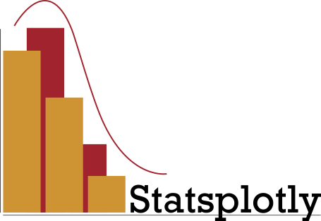

<div style="width: 50%; margin: auto; margin-bottom: 1.9rem;">
<picture>
  <source media="(prefers-color-scheme: dark)" srcset="docs/assets/statsplotly_logo.png">
  
</picture>
</div>

[](https://parici75.github.io/statsplotly)


[](https://black.readthedocs.io/en/stable/)
[](https://docs.astral.sh/ruff/)
[](https://mypy.readthedocs.io/en/stable/index.html#)
[](https://github.com/Parici75/statsplotly/actions/workflows/test.yml)
[](https://github.com/Parici75/statsplotly/actions/workflows/sphinx.yml)

[](https://github.com/Parici75/statsplotly/blob/main/LICENSE)

----------------
[Statsplotly](https://github.com/parici75/statsplotly) is a Python data visualization library based on [Plotly](https://plotly.com/). It provides a high-level interface for drawing interactive statistical data visualization plots with a tidy, declarative API.


## Philosophy

The inception of this library predates the fantastic [plotly.express](https://plotly.com/python/plotly-express/) API.

`statsplotly` key standout features are :
- independent processing of color coding scheme, data slicer and plot dimensions.
- high level interface for [seaborn-like](https://seaborn.pydata.org/tutorial/distributions.html) visualization of data distributions.
- standard statistical data processing under the hood.
- leveraging of the tidy DataFrame structure for easy styling of plot cues (e.g., marker color, symbol, size, and opacity).
- sensible cartesian and coloraxis coordinates management across figure subplots.

In summary, `statsplotly` seeks to take advantage of the powerful interactivity offered by `plotly.js` without compromising statistical intelligibility for aesthetic choices, or vice-versa.


## Documentation

Details of the public API can be found in the [documentation](https://parici75.github.io/statsplotly).

Main features of the API are demonstrated in a demo [notebook](https://nbviewer.org/github/parici75/statsplotly/blob/main/docs/notebooks/statsplotly_demo.ipynb).


## Installation

### Using Pip

```bash
pip install statsplotly
```

## Development

### Using Poetry

First make sure you have Poetry installed on your system (see [instruction](https://python-poetry.org/docs/#installing-with-the-official-installer)).

Then, assuming you have a Unix shell with make, create and set up a new Poetry environment :

```bash
make init
```

To make the Poetry-managed kernel available for a globally installed Jupyter :

```bash
poetry run ipython kernel install --user --name=<KERNEL_NAME>
jupyter notebook
```

On the Jupyter server, select the created kernel in “Kernel” -> “Change kernel”.

### Dissecting Makefile

The Makefile provides several targets to assist in development and code quality :

- `init` creates a project-specific virtual environment and installs the dependencies of the `poetry.lock` file.
- `ci` launches Black, Ruff, mypy and pytest on your source code.
- `pre-commit` set up and run pre-commit hooks (see pre-commit [documentation](https://pre-commit.com/)).
- `update-doc` and `build-doc` generates documentation from source code and builds it with [Sphinx](https://www.sphinx-doc.org/en/master/index.html).
- `clean` clears bytecode, poetry/pip caches. Use with caution.

## Requirements

- [Plotly](https://plotly.com/python/)
- [SciPy](https://scipy.org/)
- [Pydantic >=2.0](https://docs.pydantic.dev/)

## Author

[Benjamin Roland](benjamin.roland@hotmail.fr)
